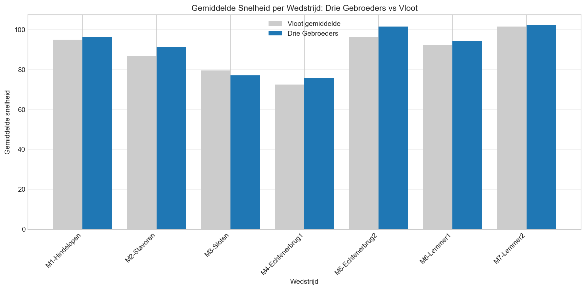
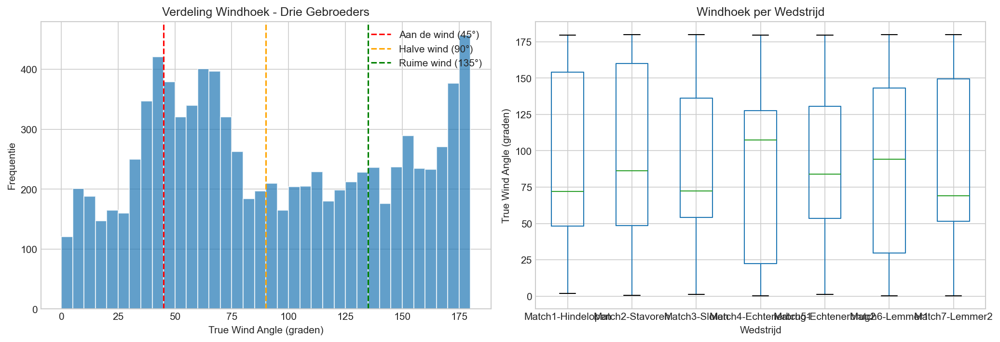
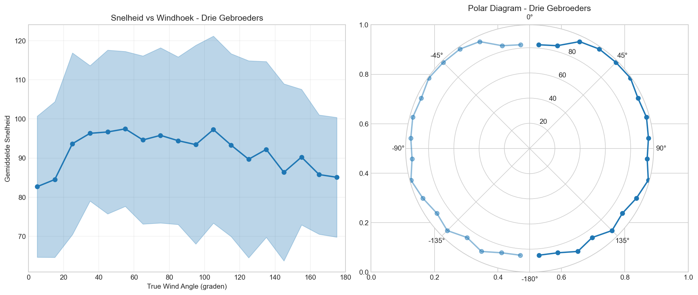
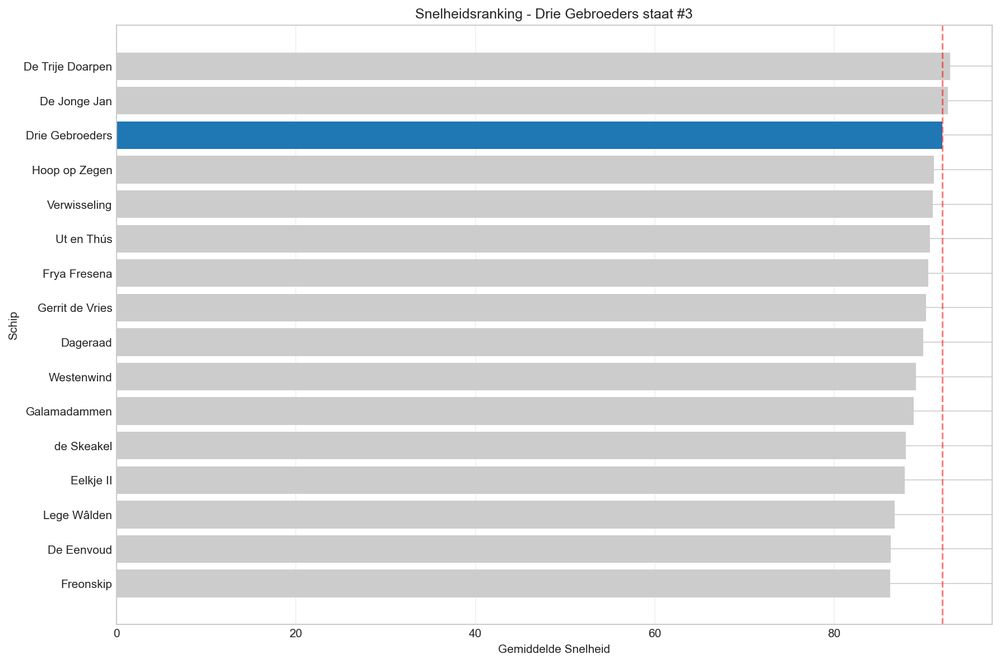
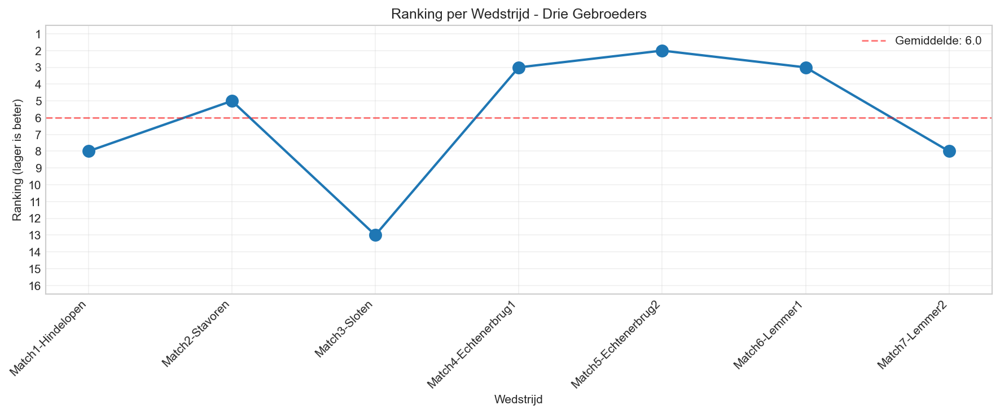
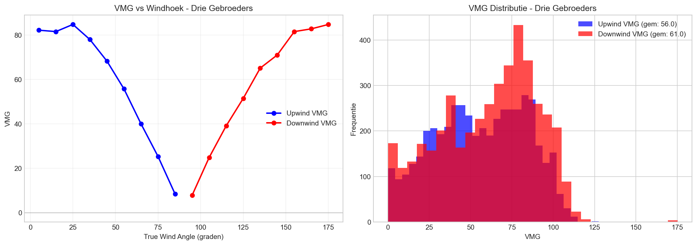

# IFKS 2025 Analyse Rapport
## Drie Gebroeders

*Gegenereerd op 04-02-2026 21:32*

---

## Samenvatting

| Statistiek | Waarde |
|------------|--------|
| Wedstrijden gevaren | 7 |
| Totaal datapunten | 9,146 |
| Gemiddelde snelheid | 92.1 |
| Maximum snelheid | 199 |
| Overall ranking | #3 van 16 |
| Gemiddelde TWA | 92.6° |
| Upwind tijd | 52.5% |
| Downwind tijd | 47.5% |

---

## 1. Snelheid per Wedstrijd

Vergelijking van de gemiddelde snelheid van Drie Gebroeders met het vlootgemiddelde.

| Wedstrijd | Drie Gebroeders | Vloot | Verschil |
|-----------|-------------|-------|----------|
| Match1-Hindelopen | 96.4 | 95.0 | +1.5 (+1.5%) |
| Match2-Stavoren | 91.3 | 86.7 | +4.6 (+5.3%) |
| Match3-Sloten | 77.0 | 79.6 | -2.6 (-3.2%) |
| Match4-Echtenerbrug1 | 75.6 | 72.4 | +3.2 (+4.4%) |
| Match5-Echtenerbrug2 | 101.4 | 96.2 | +5.2 (+5.4%) |
| Match6-Lemmer1 | 94.2 | 92.3 | +2.0 (+2.1%) |
| Match7-Lemmer2 | 102.2 | 101.5 | +0.8 (+0.8%) |

---

## 2. Windhoek Analyse (True Wind Angle)

De True Wind Angle (TWA) geeft aan onder welke hoek er ten opzichte van de wind wordt gevaren:
- **0-60°**: Aan de wind (kruisen)
- **60-120°**: Halve wind
- **120-180°**: Ruime wind / voor de wind

**Verdeling:**
- Aan de wind (0-60°): 33.2%
- Halve wind (60-120°): 32.3%
- Ruime wind (120-180°): 34.4%

---

## 3. Polar Diagram

Het polar diagram toont de gemiddelde snelheid bij verschillende windhoeken.

**Optimale hoeken:**
- Hoogste snelheid: 97.5 bij 55°

---

## 4. Ranking

### Overall Ranking (op basis van gemiddelde snelheid)

**Drie Gebroeders staat #3 van 16 schepen.**

### Ranking per Wedstrijd

| Wedstrijd | Positie |
|-----------|---------|
| Match1-Hindelopen | #8 van 16 |
| Match2-Stavoren | #5 van 15 |
| Match3-Sloten | #13 van 14 |
| Match4-Echtenerbrug1 | #3 van 16 |
| Match5-Echtenerbrug2 | #2 van 15 |
| Match6-Lemmer1 | #3 van 16 |
| Match7-Lemmer2 | #8 van 15 |

**Gemiddelde ranking: 6.0**

---

## 5. VMG Analyse (Velocity Made Good)

VMG meet de effectieve snelheid richting de wind:
- **Upwind VMG**: Hoe snel je tegen de wind in komt
- **Downwind VMG**: Hoe snel je met de wind mee komt

**Optimale VMG hoeken:**
- Beste upwind hoek: 25° (VMG: 84.7)
- Beste downwind hoek: 175° (VMG: 84.7)

---

## Wedstrijdoverzicht

| Wedstrijd | Datum | Locatie | Duur (min) |
|-----------|-------|---------|------------|
| Match1-Hindelopen | 09-08-2025 | Hindelopen | 115 |
| Match2-Stavoren | 10-08-2025 | Stavoren | 115 |
| Match3-Sloten | 12-08-2025 | Sloten | 115 |
| Match4-Echtenerbrug1 | 13-08-2025 | Echtenerbrug1 | 105 |
| Match5-Echtenerbrug2 | 14-08-2025 | Echtenerbrug2 | 120 |
| Match6-Lemmer1 | 15-08-2025 | Lemmer1 | 105 |
| Match7-Lemmer2 | 16-08-2025 | Lemmer2 | 105 |

---

*Dit rapport is automatisch gegenereerd op basis van GPS-tracking data van de IFKS 2025.*
